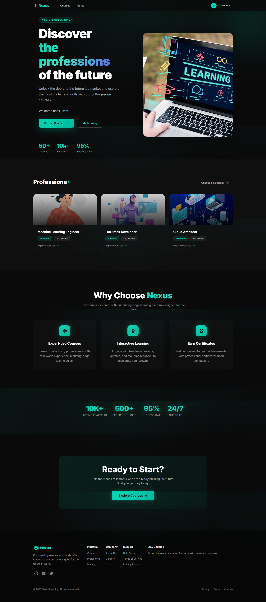

# Nexus - E-Learning Platform



A modern, full-stack e-learning platform built with React and Node.js, featuring a sleek dark-themed UI with course management, quizzes, progress tracking, and certificate generation.

## Features

### For Students
- **Browse Courses** - Explore a wide range of courses with detailed descriptions
- **Enroll in Courses** - Easy enrollment process to start learning
- **Track Progress** - Monitor your learning journey with progress indicators
- **Take Quizzes** - Interactive quizzes to test your knowledge
- **Earn Certificates** - Get PDF certificates upon course completion
- **Personal Dashboard** - View enrolled courses and learning progress

### For Instructors
- **Create Courses** - Build and publish your own courses
- **Add Lessons** - Structure your course content with multiple lessons
- **Create Quizzes** - Design quizzes to assess student understanding
- **Manage Content** - Edit and update course materials

### Platform Features
- **User Authentication** - Secure JWT-based authentication
- **Role-Based Access** - Different permissions for students and instructors
- **Responsive Design** - Beautiful UI that works on all devices
- **Modern Dark Theme** - Eye-friendly dark interface with teal accents

## Tech Stack

### Frontend
| Technology | Purpose |
|------------|---------|
| React 19 | UI Framework |
| Vite | Build Tool |
| Material-UI (MUI) 7 | Component Library |
| React Router 7 | Client-side Routing |
| Axios | HTTP Client |

### Backend
| Technology | Purpose |
|------------|---------|
| Node.js | Runtime Environment |
| Express 5 | Web Framework |
| MongoDB | Database |
| Mongoose | ODM |
| JWT | Authentication |
| PDFKit | Certificate Generation |
| Multer | File Uploads |
| Bcrypt.js | Password Hashing |

### Development Tools
| Tool | Purpose |
|------|---------|
| Nodemon | Auto-restart Server |
| Jest | Testing Framework |
| Supertest | API Testing |
| ESLint | Code Linting |

## Project Structure

```
elearning/
├── backend/
│   ├── config/
│   │   └── db.js                 # Database configuration
│   ├── controllers/
│   │   ├── authController.js     # Authentication logic
│   │   ├── courseController.js   # Course management
│   │   ├── lessonController.js   # Lesson management
│   │   ├── quizController.js     # Quiz handling
│   │   ├── enrollmentController.js
│   │   ├── progressController.js
│   │   └── certificateController.js
│   ├── middleware/
│   │   ├── authMiddleware.js     # JWT verification
│   │   └── roleMiddleware.js     # Role-based access
│   ├── models/
│   │   ├── userModel.js
│   │   ├── courseModel.js
│   │   ├── lessonModel.js
│   │   └── quizModel.js
│   ├── routes/
│   │   ├── authRoutes.js
│   │   ├── courseRoutes.js
│   │   ├── lessonRoutes.js
│   │   ├── quizRoutes.js
│   │   ├── enrollmentRoutes.js
│   │   ├── progressRoutes.js
│   │   └── certificateRoutes.js
│   ├── utils/
│   │   └── certificateGenerator.js
│   ├── tests/
│   │   ├── setup.js
│   │   └── course.test.js
│   ├── app.js
│   └── server.js
├── frontend/
│   ├── context/
│   │   └── AuthContext.jsx       # Authentication state
│   ├── src/
│   │   ├── components/
│   │   │   ├── Navbar.jsx
│   │   │   └── Footer.jsx
│   │   ├── pages/
│   │   │   ├── Home.jsx
│   │   │   ├── Courses.jsx
│   │   │   ├── CourseDetail.jsx
│   │   │   ├── CreateCourse.jsx
│   │   │   ├── MyCourses.jsx
│   │   │   ├── LessonView.jsx
│   │   │   ├── QuizView.jsx
│   │   │   ├── Profile.jsx
│   │   │   ├── Login.jsx
│   │   │   └── Register.jsx
│   │   ├── App.jsx
│   │   └── main.jsx
│   └── public/
└── package.json
```

## Getting Started

### Prerequisites
- Node.js (v18 or higher)
- MongoDB (local or Atlas)
- npm or yarn

### Installation

1. **Clone the repository**
   ```bash
   git clone https://github.com/yourusername/nexus-elearning.git
   cd nexus-elearning
   ```

2. **Install Backend Dependencies**
   ```bash
   cd backend
   npm install
   ```

3. **Install Frontend Dependencies**
   ```bash
   cd ../frontend
   npm install
   ```

4. **Environment Configuration**
   
   Create a `.env` file in the `backend` directory:
   ```env
   PORT=5000
   MONGODB_URI=mongodb://localhost:27017/elearning
   JWT_SECRET=your_jwt_secret_key
   ```

5. **Start the Development Servers**

   Backend (from `/backend` directory):
   ```bash
   npm run dev
   ```

   Frontend (from `/frontend` directory):
   ```bash
   npm run dev
   ```

6. **Access the Application**
   - Frontend: http://localhost:5173
   - Backend API: http://localhost:5000

## API Endpoints

### Authentication
| Method | Endpoint | Description |
|--------|----------|-------------|
| POST | `/api/auth/register` | Register new user |
| POST | `/api/auth/login` | User login |
| GET | `/api/auth/profile` | Get user profile |

### Courses
| Method | Endpoint | Description |
|--------|----------|-------------|
| GET | `/api/courses` | Get all courses |
| GET | `/api/courses/:id` | Get course by ID |
| POST | `/api/courses` | Create new course |
| PUT | `/api/courses/:id` | Update course |
| DELETE | `/api/courses/:id` | Delete course |

### Lessons
| Method | Endpoint | Description |
|--------|----------|-------------|
| GET | `/api/lessons/:courseId` | Get lessons for course |
| POST | `/api/lessons` | Create lesson |
| PUT | `/api/lessons/:id` | Update lesson |
| DELETE | `/api/lessons/:id` | Delete lesson |

### Quizzes
| Method | Endpoint | Description |
|--------|----------|-------------|
| GET | `/api/quizzes/:lessonId` | Get quiz for lesson |
| POST | `/api/quizzes` | Create quiz |
| POST | `/api/quizzes/:id/submit` | Submit quiz answers |

### Enrollment & Progress
| Method | Endpoint | Description |
|--------|----------|-------------|
| POST | `/api/enrollments/:courseId` | Enroll in course |
| GET | `/api/enrollments/my-courses` | Get enrolled courses |
| PUT | `/api/progress/:lessonId` | Update lesson progress |
| GET | `/api/progress/:courseId` | Get course progress |

### Certificates
| Method | Endpoint | Description |
|--------|----------|-------------|
| GET | `/api/certificates/:courseId` | Generate certificate |

## Running Tests

```bash
cd backend
npm test
```

## Screenshots

### Home Page
The landing page features a modern hero section with animated elements, statistics, and call-to-action buttons.

### Course Catalog
Browse through available courses with filtering and search capabilities.

### Learning Experience
Clean lesson view with progress tracking and quiz integration.

## Contributing

1. Fork the repository
2. Create your feature branch (`git checkout -b feature/AmazingFeature`)
3. Commit your changes (`git commit -m 'Add some AmazingFeature'`)
4. Push to the branch (`git push origin feature/AmazingFeature`)
5. Open a Pull Request

## License

This project is licensed under the ISC License.

## Acknowledgments

- [Material-UI](https://mui.com/) for the beautiful component library
- [Vite](https://vitejs.dev/) for the blazing fast build tool
- [MongoDB](https://www.mongodb.com/) for the flexible database solution

---


